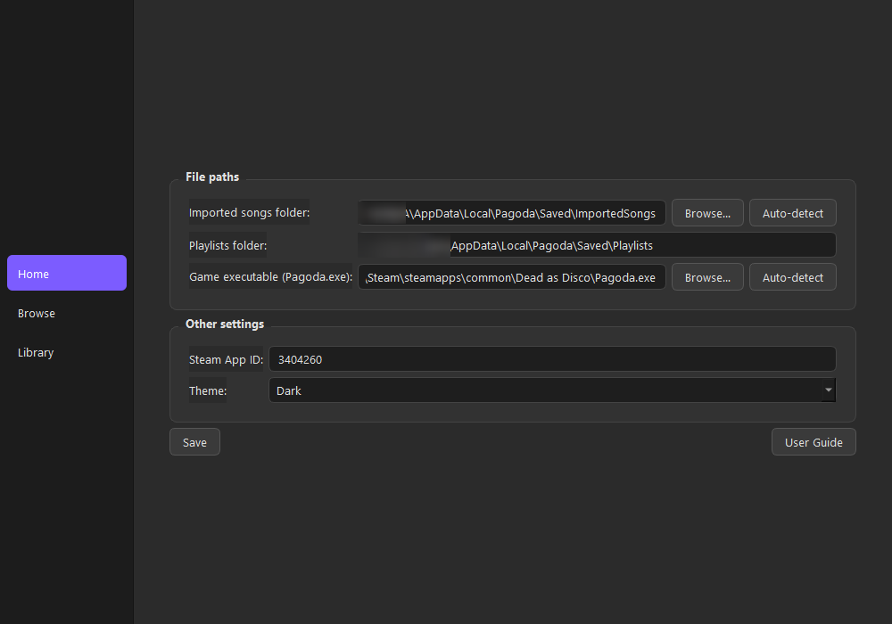
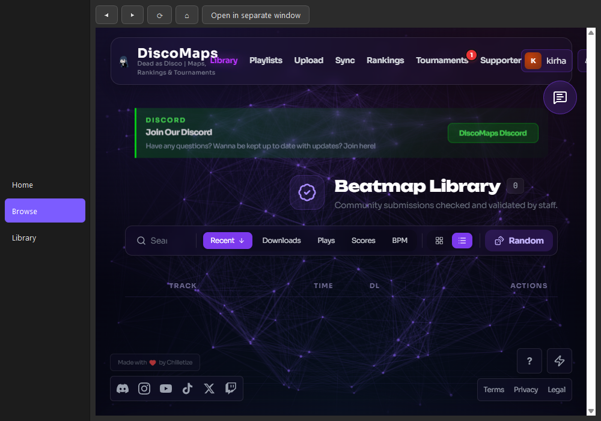
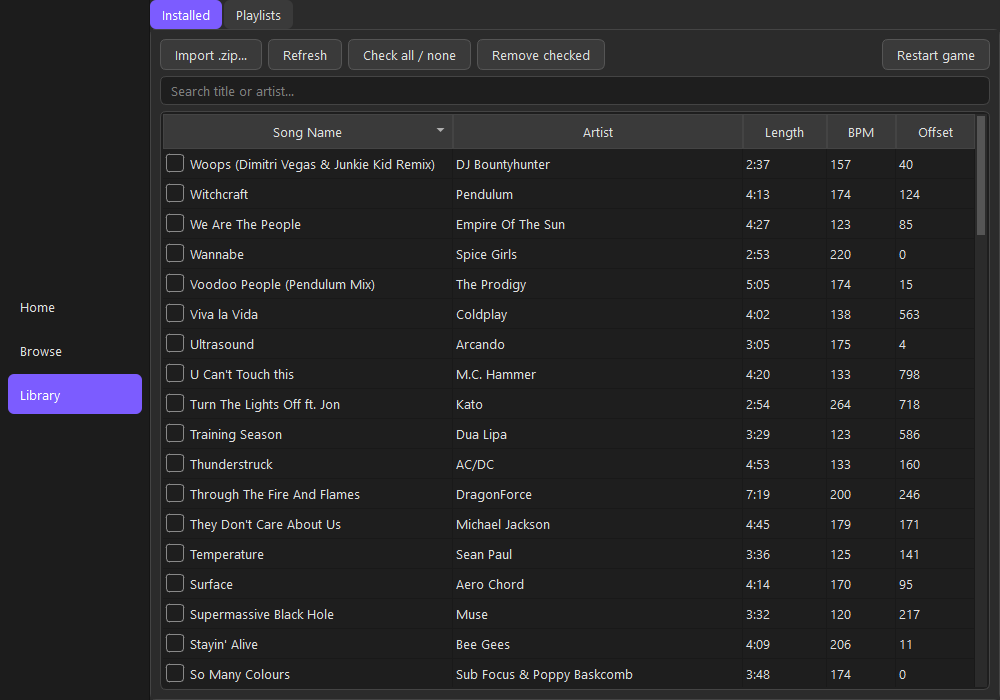
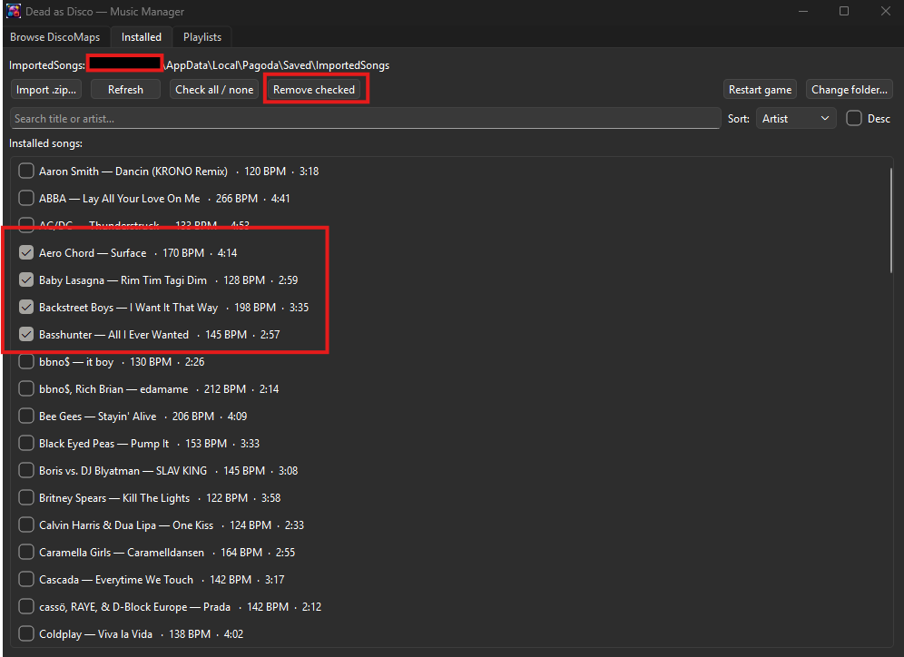
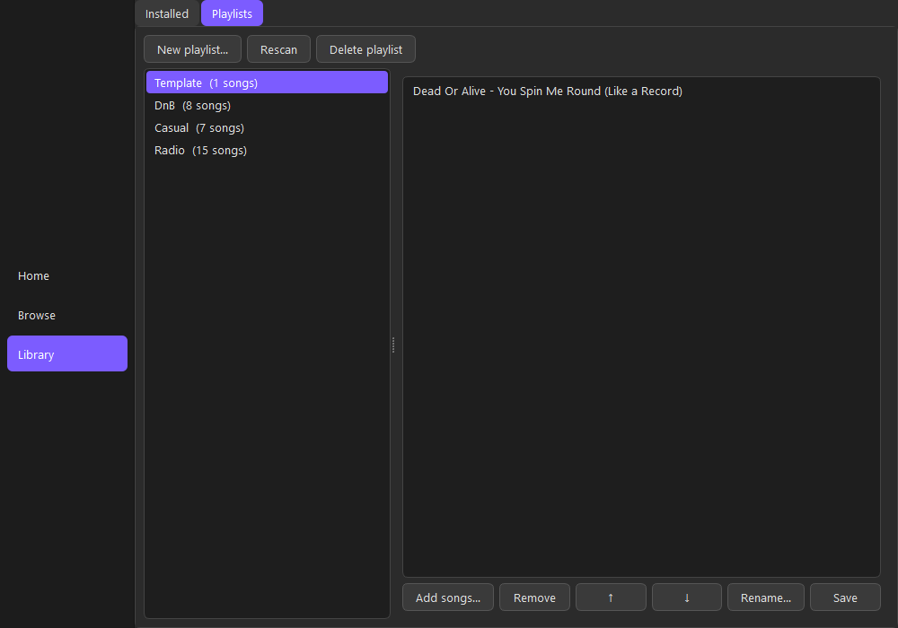
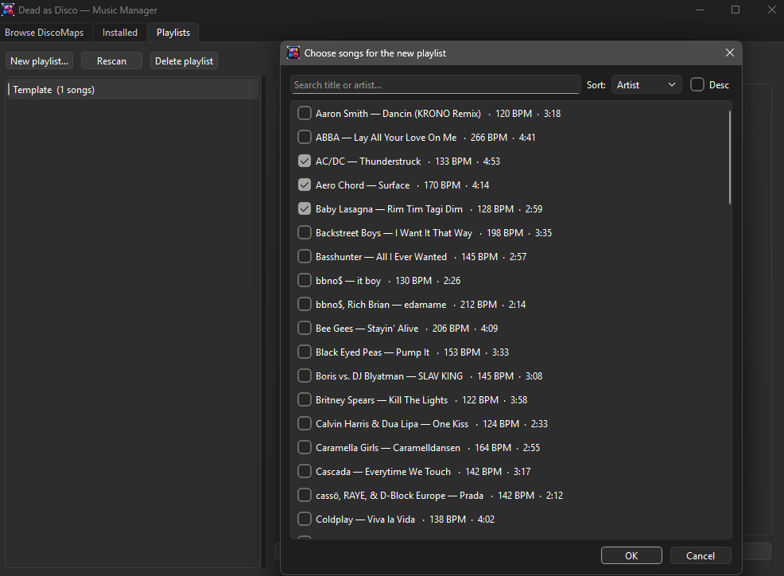

# Dead as Disco — Music Manager

> [!IMPORTANT]
> **Unofficial, AI-assisted community tool** — not affiliated with the
> developers of Dead as Disco or with DiscoMaps. Built largely with AI
> assistance to simplify my own workflow. Use at your own risk, and keep
> backups of your playlists and song files.

A desktop manager for the rhythm game **Dead as Disco**. Browse and download
custom songs, manage your installed library, and build in-game playlists —
all from one app.

---

## Features

- **Browse DiscoMaps** in an embedded browser and auto-import downloads
- **Import** map `.zip` files manually
- **Manage installed songs**: search, sort (artist / title / BPM / duration),
  and bulk-remove with checkboxes
- **Playlists**: create, edit, reorder, rename, and delete playlists of your
  imported songs
- **Restart the game** from the app to apply changes
- Simple sidebar navigation between **Home**, **Browse**, and **Library**

---

## Requirements

- Windows for the packaged `.exe` release
- Python 3.10+ to run from source
- Linux/Proton is supported from source for library, import, and playlist workflows

## Install & run

**From the packaged release:** download the app zip from the
[Releases](../../releases) page, unzip it, and run `DiscoManager.exe`.

**From source:**

```powershell
python -m venv .venv
.venv\Scripts\activate
pip install -r requirements.txt
python main.py
```

On Linux/macOS, activate the venv with:

```bash
. .venv/bin/activate
```

### Run on Linux / Proton

Install the required system packages first:

```bash
# Arch / CachyOS
sudo pacman -S --needed git python python-pip python-virtualenv

# Debian / Ubuntu
sudo apt install git python3 python3-pip python3-venv

# Fedora
sudo dnf install git python3 python3-pip
```

Then clone and run the app:

```bash
git clone https://github.com/kirhaaaaa/dead-as-disco-manager.git
cd dead-as-disco-manager
python -m venv .venv
source .venv/bin/activate
pip install -r requirements.txt
python main.py
```

If your system exposes `python3` instead of `python`, use:

```bash
python3 -m venv .venv
source .venv/bin/activate
pip install -r requirements.txt
python3 main.py
```

If the game is running through Proton, the manager should auto-detect the song
folder. If it doesn't, set **Imported songs folder** manually to:

`~/.local/share/Steam/steamapps/compatdata/<appid>/pfx/drive_c/users/<user>/AppData/Local/Pagoda/Saved/ImportedSongs`

### Qt WebEngine / PySide6 troubleshooting

The embedded browser depends on Qt WebEngine through `PySide6`. If the app
starts but the browser tab is blank or the app fails during startup:

1. Make sure you're running the app from the project virtualenv.
2. Reinstall the Python dependencies inside that venv:

   ```bash
   pip install --upgrade pip
   pip install -r requirements.txt
   ```

3. If startup still fails, run the app from a terminal and read the exact Qt /
   WebEngine error before changing anything:

   ```bash
   python main.py
   ```

On Linux, the app does **not** force the Windows ANGLE / D3D11 WebEngine flag,
so Qt uses the platform's normal graphics stack.

If PowerShell blocks venv activation, run once:
`Set-ExecutionPolicy -Scope CurrentUser -ExecutionPolicy RemoteSigned`

---

# User Guide

> [!WARNING]
> Always do playlist work with the **game closed**. Dead as Disco rewrites its
> playlist files when it saves, so edits made while the game is open will be
> lost.

## Getting started

The left sidebar switches between three sections: **Home**, **Browse**, and
**Library**.

On launch, the app opens on the **Home** page and automatically finds your
game's song folder, shown under **Imported songs folder**.



If the folder wasn't detected, click **Browse…** or **Auto-detect** next to
**Imported songs folder** and point it at:

- Windows: `%LOCALAPPDATA%\Pagoda\Saved\ImportedSongs`
- Linux/Proton: `~/.local/share/Steam/steamapps/compatdata/<appid>/pfx/drive_c/users/<user>/AppData/Local/Pagoda/Saved/ImportedSongs`

The Home page is also where you set the **game launch target** (Windows only),
your **Steam App ID**, and the app **theme** (Dark/Light).

## Browsing and downloading songs

1. Open the **Browse** section in the sidebar.
2. Log in to your DiscoMaps account (only needed once — the app remembers your
   session). On your first download, the site will ask you to set the location
   of your ImportedSongs folder — once saved, it patches songs automatically
   on download.
3. Find a map and download it as normal.
4. The app detects the download, extracts it, and installs it automatically.



Restart the game to see newly installed songs.

## Managing your installed songs

The **Library → Installed** tab lists every song with its **BPM** and **length**.



- **Search** by title or artist.
- **Sort** by artist, title, BPM, or duration, with a **Desc** toggle.
- **Import .zip…** installs a map file you downloaded manually.
- To remove songs, **tick the checkboxes** (or use **Check all / none**),
  then click **Remove checked**.



## Restarting the game

Click **Restart game** (Library → Installed tab) to close Dead as Disco and
relaunch it. On Linux/Proton the manager restarts through the configured Steam
App ID rather than launching `Pagoda.exe` directly. Use this after making
changes so they take effect.

## Playlists

### One-time setup: the Template

The manager builds new playlists from a blueprint:

1. In the **game**, create a new playlist named exactly **`Template`** and add one song
2. Fully exit the game.
3. In the manager, open **Library → Playlists** and click **Rescan**.

The Template is protected — it can't be edited or deleted from the app.



### Creating a playlist

1. Make sure the game is **closed**.
2. On the **Library → Playlists** tab, click **New playlist…**
3. Enter a name.
4. In the song picker, **tick the songs** you want (search and sort work
   here too), then click **OK**.
5. Restart the game to see your new playlist.



### Editing a playlist

Select a playlist, then use the buttons under the song list:

- **Add songs…** — add more songs from your library
- **Remove** — remove the selected song(s)
- **↑ / ↓** — reorder songs
- **Rename…** — change the playlist's name
- **Save** — write your changes (then restart the game)

> [!NOTE]
> The manager only edits playlists made of **imported** songs. Playlists that
> contain built-in game songs must be edited in-game.

### Deleting a playlist

Select it and click **Delete playlist**. (The Template can't be deleted here.)

## Game 0.1.1 — custom song fix

Game update 0.1.1 changed how custom songs load. Songs imported before the
update may show a "source file no longer exists" error in-game. The manager
handles this automatically:

- **New downloads** are patched on import (no action needed).
- **Existing library:** click **Fix songs for 0.1.1** on the Library → Installed
  tab (close the game first). This writes the required metadata fields into
  each song's `Meta.json` so the game can find the audio file again.

## Tips & troubleshooting

- **Changes don't show in-game?** Restart the game — it only reads playlists
  and songs at startup.
- **"Game is running" warning?** Close Dead as Disco before creating or
  saving playlists, or your changes will be overwritten.
- **A song you added doesn't appear in-game?** It may be a built-in game song
  (only imported songs can be added via the manager).
- **Backups:** the manager saves a `.bjpl.bak` copy the first time it edits a
  playlist, so your original is preserved.

---

## Building from source

```powershell
pip install pyinstaller
pyinstaller DiscoManager.spec
```

On Linux, the equivalent build flow is:

```bash
# Arch / CachyOS
sudo pacman -S --needed python python-pip python-virtualenv

# Debian / Ubuntu
sudo apt install python3 python3-pip python3-venv

# Fedora
sudo dnf install python3 python3-pip

python -m venv .venv
source .venv/bin/activate
pip install -r requirements.txt
pip install pyinstaller
pyinstaller DiscoManager.spec
```

The runnable app is the **`dist/DiscoManager/`** folder (use the folder build,
not one-file — the embedded browser needs it). Zip and share that folder.

## Notes

- Settings and the embedded browser's login/cache are stored in
  `%APPDATA%\DiscoManager` on Windows or `~/.config/disco-manager` on Linux.

---

> [!IMPORTANT]
> This is a fan-made tool, not affiliated with or endorsed by the creators of
> Dead as Disco or DiscoMaps. All custom songs and maps belong to their
> respective creators. Developed with AI assistance.
